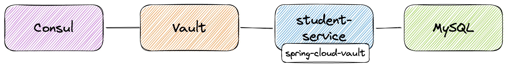
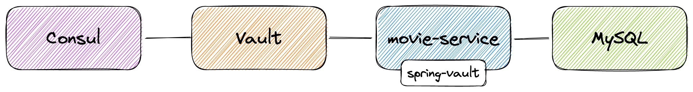
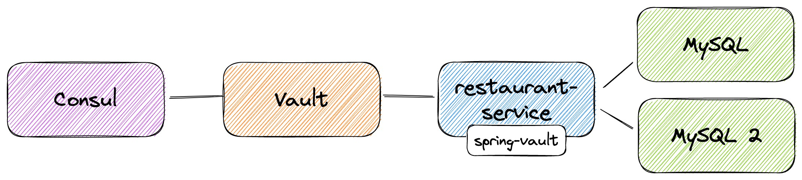

# springboot-vault-examples

The goal of this project is play with [`Vault`](https://www.vaultproject.io). For it, we will implement some applications that rely on `Vault` to store/retrieve secrets. The credentials to access databases are generated dynamically by [`Vault`](https://www.vaultproject.io) that uses [`Consul`](https://www.consul.io) as backend.

## Proof-of-Concepts & Articles

On [ivangfr.github.io](https://ivangfr.github.io), I have compiled my Proof-of-Concepts (PoCs) and articles. You can easily search for the technology you are interested in by using the filter. Who knows, perhaps I have already implemented a PoC or written an article about what you are looking for.

## Lease Rotation

One of the problems faced by many people when using `Vault` is about rotating the lease obtained for some backend databases. When a [`Spring Boot`](https://docs.spring.io/spring-boot/docs/current/reference/htmlsingle/) application requests a lease from `Vault` using, for instance, the library [`Spring Cloud Vault`](https://cloud.spring.io/spring-cloud-vault/spring-cloud-vault.html), the library itself **is able to automatically renew** the lease from time to time (`default_lease_ttl`).

However, when the maximum expiration time of a lease is reached (`max_lease_ttl`), it means that the lease cannot be renewed anymore, and a new lease is required. In this situation, `Spring Cloud Vault` library **cannot rotate** it, leaving the application without connection to database.

In order to solve this problem, I have implemented some solutions for applications that use `Spring Cloud Vault` or [`Spring Vault`](https://docs.spring.io/spring-vault/docs/2.1.3.RELEASE/reference/html/#_document_structure). Please, have a look at the examples below.  

## Examples

| Example                                                                                                                                                                                  | Diagram                                                                             |
|------------------------------------------------------------------------------------------------------------------------------------------------------------------------------------------|-------------------------------------------------------------------------------------|
| [spring-cloud-vault-approle-mysql](https://github.com/ivangfr/springboot-vault-examples/tree/master/spring-cloud-vault-approle-mysql) **(with lease rotation)**                          |              |
| [spring-cloud-vault-approle-cassandra](https://github.com/ivangfr/springboot-vault-examples/tree/master/spring-cloud-vault-approle-cassandra)                                            |          |
| [spring-vault-approle-mysql](https://github.com/ivangfr/springboot-vault-examples/tree/master/spring-vault-approle-mysql) **(with lease rotation)**                                      |                    |
| [spring-vault-approle-multi-datasources-mysql](https://github.com/ivangfr/springboot-vault-examples/tree/master/spring-vault-approle-multi-datasources-mysql) **(with lease rotation)**  |  |

## Prerequisites

- [`Java 17+`](https://www.oracle.com/java/technologies/downloads/#java17)
- [`Docker`](https://www.docker.com/)

## Initialize Environment

Open a terminal and, inside `springboot-vault-examples` root folder, run the following script
```
./init-environment.sh
```

This script will:
- start `Consul`, `Vault`, `MySQL`, and `Cassandra` Docker containers;
- unseal `Vault` and enable `AppRole` in it;
- setup Database `roles` and `policies` in Vault for the application so that they can access their databases using dynamically generated credentials;
- setup `KV Secrets` in `Vault` for the application;

## Shutdown Environment

To shut down the environment, go to a terminal and, inside `springboot-vault-examples` root folder, run the script below
```
./shutdown-environment.sh
```

## Cleanup

To remove all Docker images created by this project, go to a terminal and, inside `springboot-vault-examples` root folder, run the following script
```
./remove-docker-images.sh all
```

## References

- https://github.com/spring-cloud/spring-cloud-vault/issues/85
- https://blog.ruanbekker.com/blog/2019/05/07/use-the-vault-api-to-provision-app-keys-and-create-kv-pairs/
